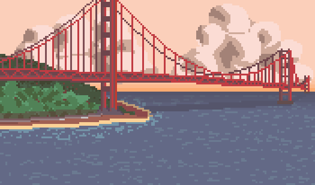

  <samp>
    Hello! My name is Ruot :)
     
     
    
     
     
    Software Engineering !
      
    * #DevCommunity * #MakeSchool * Mongoose * Chai Testing * Flutter * ReactJs * MySql *
                    || Can code in , Python, and Java ||  
                        Located in the Bay Area 

 
 

  Made with GitHub Markdown
   
    
  

